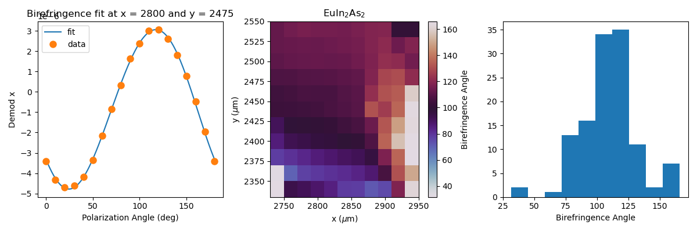

`orenstein-analysis` is a functional python package for loading, processing, and manipulating hierarchical and multidimensional datasets in Joe Orenstein's optics laboratory at UC Berkeley. The best way to think about this packages is as a set of general tools to streamline scripting of new data pipelines and recycle code common to all analysis - most of the heavy lifting comes from xarray and the user can focus on writing only code that is specific to their experiment. See below for a quick example.

The package builds on top of the xarray DataArray and Dataset data structures - for a good introduction to xarray see the [xarray Getting Started and User Guide](https://docs.xarray.dev/en/stable/getting-started-guide/index.html).

Briefly, xarray DataArrays are labeled, indexed wrappers around numpy ndarrays. In addition, there is a high-level distinction between data variables (ndarrays of dependent variables, for example temperature as function of x, y, and z), coordinate variables (ndarrays for independent variables, such as the x, y and z vectors), and dimensions (labels for each axis associated with a data or coordinate variable, such as 'x', 'y', and 'z'). Once data has been put into a Dataset, which is essentially a dictionary of DataArrays, working with the data is highly intuitive and simple. The choice to work with xarray is based on the following:

1. highly functional - for example, storing multidimensional datasets into one data structure reduces the task of processing and isolating desired sections of the data to a few lines of easy-to-read code, coordinates and dimensions are implicitly carried through operations which significantly simplifies code and makes it more readable.
2. general - xarray handles common low-level manipulation of arbitrary datasets so that users can focus on the specifics that differ from dataset to dataset.
3.  extendable - easy to adopt new measurement modalities and datasets without having to rewrite or copy-paste

### Setup

To setup this package, firts make a GitHub account if you don't have one already and follow [this how-to](https://docs.github.com/en/authentication/connecting-to-github-with-ssh) to get setup with an SSH key. Then:

1. install git. For homebrew users, run on command line: `brew install git`
2. clone this repository. On the command line run: `git clone git@github.com:alexliebmanp/orenstein-analysis.git`
3. add package path to PYTHONPATH variable of whatever terminal emulator or python IDE that you use. For example, follow [this](https://stackoverflow.com/questions/3402168/permanently-add-a-directory-to-pythonpath).

Now you can easily import anything in the pacakge, e.g. `import orenstein_analysis`!

### Data organization

Although today there are many powerful databases for storing and organizing data (such as HDF5 or netCDF, which xarray is based on), for the sake of backward compatibility with existing methods of storing data, `orenstein-analysis` assumes the following structure for loading data.

At the core of any optics measurement in the Orenstein Lab is a 1-dimensional dataset. For example, in a pump-probe measurement we measure some signal (and other observables or diagnostics) as a function of time-delay, which gets stored as a text file of the form:

```
[METADATA]
...
...
[DATA]
time delay (ps) signal 1 (V) signal 2  (V)
... ... ...
... ... ...
```

Multidimensional datasets are built up in a directory as a set of such text files with names that specify additional coordinates. For example, a pump-probe experiment as a function of temperature might look like:

```
data_directory/
  pumpprobe_10K_100mW.txt
  pumpprobe_20K_100mW.txt
  pumpprobe_30K_100mW.txt
```

The `loader.load_measurement()` function loads 1 dimensional data from a single text file into an xarray Dataset, while `loader.load_ndim_measurement()` searches through a directory and assembles a multidimensional Dataset, extracting and organizing other coordinates based on the filename and a few simple user inputs (future work will include ability to search metadata for other coordinates). For example, after a call to `loader.load_ndim_measurement()`, the user will have access to a data set 'signal 1 (V)' which is a function of 'time delay (ps)' and 'temperature (K)'. It is emphasized that adding additional coordinates is trivial within this framework.

### Workflow

The intended workflow for `orenstein-analysis` reflects the underlying 1D nature of our experiments while still leaving options for post processing on multidimensional sets.

The main feature of `loader.load_measurement()` and `loader.load_ndim_measurement()` is the `instruction_set` **kwarg, which accepts a list of functions `[f1, f2, f3, ...]`. These are functions, typically defined within an analysis notebook, which accept an xarray Dataset as the only argument and return a modified Dataset. Both loading functions sequentially process each 1-dimensional Dataset after importing, such that if `ds` is the initial dataset, at the end of the loading operation the stored dataset is `f3(f2(f1(ds)))`.

As the example below illustrates, there are several types of functions that can be put into the `instruction_set`, however the function `process.add_processed()` is a useful utility that can be used to easily build such functions, among other things. It takes a measurement and a list of tuples of the form (function, arguments) and returns a modified Dataset with new data and coordinate variables according the output of function(measurement, *arguments). Each function must take a measurement as the first argument and returns data_vars and coord_vars, which are dictionaries for variables as specified in the xarray documentation (for example, data_var = {'new_var1':(dims, data)}). This may be a bit confusing, but once you get the hang of it it becomes very easily to quickly add new variables to the dataset through some processing. This is at the small cost of structuring user function arguments and returns.

Following our example above, each time trace might be fit to a given functional for at each temperature and then the multidimensional Dataset will include a data variable containing the time constant as a function of temperature.

In addition, the `process.add_processed()` function can be used to incoporate more elaborate processing, such as taking a 2D Fourier transforms on already processed data and adding the FT as well as the wave-vector coordinates to the Dataset.

### Example

The following is an example of a birefringence experiment the measures a balanced photodiode as a function of the co-rotation of two half-wave-plates and space (x and y). This example can be run in the tests directory of this package.

```
import os
from orenstein_analysis.measurement import loader
from orenstein_analysis.measurement import process
from orenstein_analysis.experiment import experiment_methods
import xarray as xr
import numpy as np
import pandas as pd
import matplotlib.pyplot as plt

# specify path to directory containing datafiles (and only datafiles)
path = os.path.dirname(os.path.realpath(__file__))+'/test_data/'

# define functions for processing, which accept a measurement and return a measurement. These functions wrap more elaborate functions which forms the backbone of the user input. It is in writing these functions that the user tailors to their application.
set_coord = lambda meas: process.define_dimensional_coordinates(meas, {'Polarization Angle (deg)':2*meas['Angle 1 (deg)']})

fit_bf = lambda meas: process.add_processed(meas, (experiment_methods.fit_birefringence, ['Polarization Angle (deg)', 'Demod x']))

# load and preliminary processing of data. Note the only other user input is in defining the new coordinates and python regex strings for extracting coordinate values from filename.
ndim_meas = loader.load_ndim_measurement(path, {'x ($\mu$m)':'_x[0-9]+', 'y ($\mu$m)':'_y[0-9]+'}, instruction_set=[set_coord, fit_bf])
print(ndim_meas)

# visualize data
fig, [ax1, ax2, ax3]  = plt.subplots(1,3)

ndim_meas['Demod x (fit)'].sel({'x ($\mu$m)':2800, 'y ($\mu$m)':2475}, method='nearest').plot(ax=ax1, label='fit')
ndim_meas['Demod x'].sel({'x ($\mu$m)':2800, 'y ($\mu$m)':2475}, method='nearest').plot(ax=ax1, marker='o', ms=8, linestyle='None', label='data')
ax1.legend()
ax1.set_title('Birefringence fit at x = 2800 and y = 2475')

ndim_meas['Birefringence Angle'].plot(ax=ax2, cmap='twilight')
ax2.set_title(r'EuIn$_2$As$_2$')

xr.plot.hist(ndim_meas['Birefringence Angle'], ax=ax3)

fig.set_size_inches(12, 4, forward=True)
plt.tight_layout()
plt.show()
```


What this should convey is that once data has been loaded, visualizing and extracting various components is *very* simple and convenient. As a result, users can focus on writing project specific code only.

For the above example, the user defined functions that make it run are relatively short and specific. The only requirements imposed by this package are the format of the inputs and outputs:

```
import numpy as np
import pandas as pd
import xarray as xr
import scipy.optimize as opt
import matplotlib.pyplot as plt

def fit_birefringence(measurement, x_var, y_var, p0=None):
    '''
    fits a corotation scan to 2theta and 4theta components.

    y(x) = a1*sin(2*x + phi1) + a2*sin(4*x + phi2) + b

    args:
        - measurement(Dataset):
        - x(string):
        - y(string):

    returns:
        - data_vars:                dict of tuples (None, val) where the name is a fit parameter and val the corresponding value.
        - coord_vars:               set to None.

    *kwargs:
        - p0:                       list of arguments
    '''
    x = measurement[x_var].data
    y = measurement[y_var].data
    f = lambda var, a2, phi2, a1, phi1, b: a1*np.sin(2*(var+phi1)/180*np.pi) + a2*np.sin(4*(var+phi2)/180*np.pi) + b
    if p0==None:
        a10 = (1/2)*np.max(y)
        a20 = (1/2)*np.max(y)
        phi10 = 0
        phi20 = 0
        b = (1/2)*np.max(y)
        p0 = [a20, phi20, a10, phi10, b]
    popt, pcov = opt.curve_fit(f, x, y, p0=p0)
    xfit = np.linspace(x[0], x[-1],1000)
    yfit = np.asarray([f(i, *popt) for i in xfit])
    popt = redefine_fit_angles(popt)
    names = ['4Theta Amplitude', '4Theta Angle', 'Birefringence Amplitude', 'Birefringence Angle', 'Birefringence Offset']
    data_vars = {}
    coord_vars= {}
    for ii, name in enumerate(names):
        data_vars[name] = ((), popt[ii])
    coord_vars[x_var+' (fit)'] = xfit
    data_vars[y_var+' (fit)'] = ((x_var+' (fit)'), yfit)
    return data_vars, coord_vars


def redefine_fit_angles(params):
    '''
    helper function for fit_birefringence(), which
    '''
    if params[0]<0:
            params[0]=-params[0]
            params[1]=params[1]+180/4
    #postive amplitude 2theta
    if params[2]<0:
        params[2]=-params[2]
        params[3]=params[3]+180/2
    while params[1]>90:
        params[1]=params[1]-90
    while params[1]<0:
        params[1]=params[1]+90
    while params[3]<0:
        params[3]=params[3]+180
    while params[3]>180:
        params[3]=params[3]-180
    return params
```

### A few final remarks

The syntax for this package needs to be consistent, intuitive, and clear. All data is stored in a xarray Dataset as a DataArray. To distinguish from the xarray syntax so as to avoid confusion between code native to xarray and code native to this package, we will often refer to a Dataset as a measurement. Sometimes, however, the two terms are used interchangeably. If needed, DataArrays will be referred to as measurement_data

In addition, the package is divided into two module categories. (1) measurement methods, which are general purpose and do not reference any specific type of experiment, and (2) experimental methods, which is a space to add specific functionality on top of the measurement methods.

For more information on python regular expressions (regexp), which are used to loader.load_ndim_measurement() to extract coordinate values, see [this nice tutorial](https://docs.python.org/3/howto/regex.html#regex-howto)
